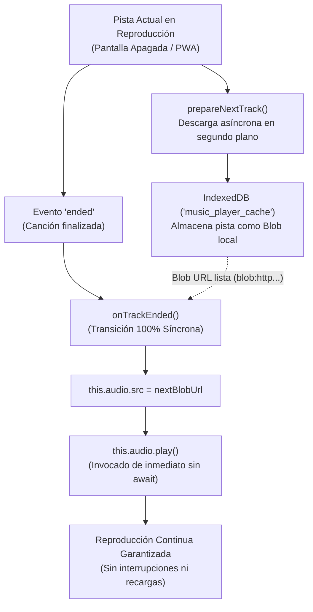

# 🎵 Music Cloud App (v2.2.5)

> **Buscador de Artistas y Discografía, Descargador de YouTube y Reproductor Cloud con Rclone & WireGuard VPN.**

Aplicación web autocontenida (Docker / PWA) diseñada para explorar discografías oficiales vía **Deezer**, escuchar preescuchas de 30s sin anuncios, descargar canciones y álbumes completos en alta calidad MP3 a través de **YouTube**, almacenar la música en la nube con **Rclone** y proteger todas las conexiones salientes mediante **WireGuard VPN**.

---

## ✨ Novedades de la Versión 2.2 (v2.2.0 – v2.2.5)

* 🚀 **Solución Definitiva a la Reproducción en Segundo Plano y Pantalla Apagada (Mobile PWA & Screen-Off Fix - v2.2.5)**:
  * **Diagnóstico de la Causa Raíz en Móviles (Android / iOS)**:
    * *Restricciones del Ciclo de Vida Móvil*: Los navegadores móviles (WebKit en iOS, Chromium en Android) suspenden la autorización de reproducción en segundo plano (*user activation token*) si se instancian nuevos elementos de audio en diferido. El uso de elementos duales alternantes (`audioA` / `audioB`) en segundo plano fracasa arrojando `NotAllowedError`.
    * *Suspensión de Web Audio API*: Al bloquear la pantalla o cambiar de pestaña, el sistema operativo congela o suspende el `AudioContext`. Si el audio pasa por nodos de Web Audio (`createMediaElementSource`), la suspensión del contexto silencia o distorsiona el flujo.
    * *Pérdida de la cadena de eventos sincrónica*: En el evento `ended`, cualquier llamada asíncrona (`await ...`) previa a `audio.play()` rompe la continuidad de autorización ante el navegador móvil.
    * *Inanición por latencia de red*: Tiempos de espera prolongados en el streaming de backend hacían que el hilo móvil se congelara por inactividad tras varios segundos con la pantalla apagada.
  * **Solución de Ingeniería e Implementación**:
    * **Instancia Única y Persistente de `<audio>`**: Todo el reproductor opera sobre un único elemento HTML5 Audio nativo, inicializado en la primera interacción del usuario. Nunca se recrea ni se destruye.
    * **Transición Síncrona Inmediata en `ended`**: Al finalizar una pista, la asignación de `audio.src` y la llamada `audio.play()` ocurren de forma estrictamente síncrona en el mismo ciclo del evento, preservando la sesión de audio del sistema.
    * **Pre-cacheo Proactivo en IndexedDB (`prepareNextTrack` y `preCachePlaylist`)**: Mientras suena la pista actual (incluso en reposo), el reproductor descarga y guarda preventivamente la siguiente pista en IndexedDB. Al dispararse `ended`, la siguiente canción ya está lista como `Blob` local (`blob:http...`), iniciándose instantáneamente en 0 ms.
    * **Bypass de Web Audio API**: Audio nativo directo a través del motor HTML5 sin intermediación de `AudioContext`, garantizando que el sistema operativo mantenga el hilo de reproducción activo.
    * **Fast Fallback en Backend (`/api/stream_yt`)**: El servidor reduce el tiempo de espera a un máximo de 1.0s; si el stream no está listo de inmediato, emite una redirección HTTP 302 hacia el stream directo de YouTube para evitar que el buffer del móvil quede vacío.
    * **Prevención de Recarga Involuntaria**: Eliminada la recarga innecesaria que reiniciaba la aplicación al devolver el foco a la ventana o PWA.

* 🎛️ **Simplificación del Reproductor y Centrado Simétrico de Controles**:
  * **Eliminación de Complejidades Inestables**: Se prescindió del ecualizador gráfico, del modo aleatorio forzado y del selector redundante de "modo sólo caché", garantizando una reproducción nativa ultra-estable.
  * **Auto-Caché Transparente**: Toda pista agregada a la lista de pistas disponibles se almacena automáticamente en la base de datos local IndexedDB.
  * **Botonera Centrada y Simétrica**: Se retiró el botón de eliminación de pista de la barra inferior y se trasladó el temporizador de apagado a la izquierda, logrando una disposición equilibrada respecto a Play/Pause:
    $$\text{[Temporizador]} \quad \text{[Anterior]} \quad \mathbf{[Play / Pause]} \quad \text{[Siguiente]} \quad \text{[Pistas/Cola]}$$
  * **Bumping de Versión y Cache-Busting (v2.2.5)**: Actualización del identificador en cabecera y en el Service Worker (`music-app-v2.2.5`) para invalidar cachés obsoletas en clientes PWA.

---

## 📦 Novedades de la Versión 2.0 (v2.0.0 – v2.1.0)

* 🔊 **Eliminación Definitiva del Sonido Entrecortado en PWA y Pantalla Bloqueada (v2.1.0)**:
  * **Solución al entrecorte inicial en segundo plano**: Corregido el problema por el cual al bloquear la pantalla del móvil, la reproducción sufría micro-cortes y sonaba entrecortada durante los primeros segundos del tema.
  * **Colchón de búfer garantizado al iniciar (`preload="auto"` y espera de 1.5s)**: Al iniciar un tema por streaming sobre red móvil, el reproductor valida que exista un margen mínimo de 1.5 segundos antes de comenzar la emisión audible, evitando que el navegador móvil caiga en el bucle de starvation (reproducir 20ms, esperar paquete, reproducir 20ms).
  * **Control reactivo de inanición en `waiting` y `stalled`**: El evento `waiting` ahora pausa preventivamente el elemento de audio para permitir la recarga íntegra del colchón de seguridad antes de reanudar, eliminando el tartamudeo.
  * **Web Audio resiliente (`latencyHint: 'playback'`)**: El grafo de ecualización y limitador se inicializa con búfer de alta latencia y escucha el evento `statechange` para reanudar automáticamente el `AudioContext` en caso de suspensión del sistema operativo en reposo.
  * **Ahorro de datos y ancho de banda en segundo plano (`visibilitychange`)**: La comprobación periódica de descargas activas (`pollDownloads`) y guardado de estado se pausan mientras la pantalla esté apagada o la app en segundo plano (`document.hidden`), liberando el 100% de la conexión móvil para el streaming continuo de audio.
  * **Reconexión instantánea al desbloquear**: Al volver al primer plano, el reproductor comprueba y reanuda inmediatamente el flujo y el `AudioContext` si sufrieron retardo en reposo.
* 📻 **Servidor Navidrome Integrado (Subsonic & OpenSubsonic - v2.0.7)**:
  * **Transmisión Subsonic sin abrir puertos**: Servidor Navidrome integrado en la pila Docker y expuesto internamente en la red `proxy` (`http://wg_music_tunnel:4533`) para su publicación segura mediante Nginx Proxy Manager en `musica.tejelonsos.es`.
  * **Aislamiento de la biblioteca en la nube**: Sincronización automática de enlaces simbólicos que expone **exclusivamente los archivos de audio de la biblioteca** montada en Google Drive (omitiendo por completo carpetas ajenas como `Backups`, `radares`, `strava`, scripts, etc., protegiendo la cuota de la API de Google Drive).
  * **Sincronización en tiempo real**: Al descargar, renombrar o eliminar canciones desde la aplicación web, la biblioteca de Navidrome se actualiza automáticamente.
  * **Compatibilidad universal con clientes móviles**: Conexión directa desde clientes Subsonic para smartphone y escritorio como **Symfonium** (Android), **Amperfy / Substreamer** (iOS) y **Feishin** (Windows/Linux/macOS) usando `https://musica.tejelonsos.es`.
  * **Acceso directo en la UI**: Enlaces directos en la barra de navegación, menú móvil y panel de Ajustes con monitorización de estado y botón de sincronización manual.
* 🔋 **Reproducción Continua en Segundo Plano (Mobile PWA & Screen-Off Fix - v2.0.6)**:
  * **Solución definitiva al corte de ~0.5s**: Corregido el problema crítico por el cual al terminar una canción y auto-avanzar a la siguiente, la reproducción se detenía a los pocos instantes en dispositivos móviles con pantalla apagada o en segundo plano.
  * **Reanudación automática ante pausas involuntarias**: Distinción estricta entre pausas manuales del usuario y pausas forzadas por ahorro de batería del SO o micro-desconexiones de red, manteniendo siempre el estado de reproducción y reintentando la reproducción de forma transparente.
  * **Prioridad absoluta al streaming inicial**: La descarga en caché de la pista finalizada se pospone 12 segundos para no saturar el ancho de banda móvil mientras arranca el nuevo tema. Se evita además la descarga remota de análisis de silencios con la pantalla apagada.
  * **Web Audio optimizado para reproducción continua**: Inicialización del `AudioContext` con `latencyHint: 'playback'` y reconexión automática tras suspensión del sistema.
* 📊 **Ordenación Inteligente por Reproducciones Mensuales («Top mes»)**:
  * Botón interactivo de la estrella en la vista de pistas disponibles con **flechas dinámicas de dirección**:
    * **Flecha hacia abajo (↓)**: Ordena de **más a menos reproducciones** (orden descendente).
    * **Flecha hacia arriba (↑)**: Ordena de **menos a más reproducciones** (orden ascendente).
  * **Alternancia continua (2 estados)**: Cada clic conmuta entre ambas direcciones con retroalimentación inmediata (*toast* informativo).
  * **Ventana móvil estricta de 30 días**: La ordenación se basa exclusivamente en las reproducciones ocurridas en los últimos 30 días (umbral de escucha de 15 segundos o el 50% de la pista).
  * **Sincronización en tiempo real**: Registro cliente-servidor (`/api/track/listen` y `/api/tracks/play_stats`) y distintivo visual (*play badge*) con el número de reproducciones en cada canción.
  * **Reproducción ininterrumpida**: Al ordenar la lista, la pista activa mantiene su reproducción y el índice se recalcula al vuelo sin saltos.
* 🛡️ **Optimización de la Cola de Pistas Disponibles**:
  * Retirada del botón destructivo de vaciado masivo de la lista para evitar pérdidas accidentales de la cola de reproducción.
  * Mantenimiento de la eliminación individual segura pista a pista y botón para guardar la cola actual como lista personalizada.
* ⏱️ **Temporizador de Apagado (Sleep Timer)**:
  * Modal dedicado para programar el apagado automático de la música.
  * Modos flexibles: por minutos predefinidos (30 min, 60 min...), al finalizar la canción en curso (`track_end`) o al completarse la lista (`playlist_end`).
  * **Desvanecimiento progresivo (*soft fade out*)**: Reducción suave del volumen durante los últimos 6 segundos antes de pausar la reproducción.
  * Indicador visual con *badge* activo en la barra inferior del reproductor.
* 🎚️ **Ecualizador Gráfico Web Audio API & Normalización de Volumen**:
  * Procesamiento digital en tiempo real con ecualizador paramétrico y presets de audio (Rock, Pop, Jazz, Clásica, Graves / Bass Boost, Voces).
  * Normalización automática con nodos de dinámica y compresión (`DynamicsCompressorNode` y `GainNode`) para unificar el volumen entre diferentes fuentes de audio.
* 📶 **Modo Solo Caché (Ahorro Extremo de Datos)**:
  * Interruptor para reproducir exclusivamente las pistas almacenadas localmente en la caché del navegador (IndexedDB).
  * Salto inteligente automático que evita consumir datos móviles con pistas no cacheadas.
* ✏️ **Edición de Metadatos de Canción (ID3)**:
  * Modal para modificar título y artista de cualquier pista de la biblioteca directamente desde la interfaz web.
  * Actualización física inmediata de las etiquetas ID3 del archivo MP3 mediante `mutagen` y sincronización en todas las listas de reproducción.
* 🔁 **Sustitución de Versión Alternativa (Replace Version)**:
  * Permite buscar en YouTube versiones alternativas (en directo, acústicas, remasterizadas) de cualquier tema existente.
  * Reemplaza el archivo de audio físico manteniendo las asociaciones en listas, metadatos y enlaces.
* 💾 **Gestión Inteligente de Cuota Cloud (LRU Purge)**:
  * Configuración de límite de almacenamiento en disco/nube (`/api/storage/cloud_settings`).
  * Mecanismo automático de limpieza por antigüedad y frecuencia de escucha (política LRU) para mantener el espacio dentro de la cuota fijada.
  * Opción de forzar la limpieza manual en cualquier momento (`/api/storage/clean_cloud`).

---

<details>
<summary><b>📦 Historial de Versiones Anteriores (v1.5.0)</b></summary>

* 🎛️ **Modal de Pistas Disponibles al 90%**: Visualización panorámica con desenfoque de fondo (`backdrop-blur-md`), carátulas y salto instantáneo de canción.
* 🖼️ **Acceso a Opciones desde la Portada**: Despliegue de la ficha de la canción pulsando en la portada del reproductor.
* 🔁 **Deduplicación Automática y Bucle Continuo**: Eliminación de duplicados previos al añadir pistas y avance en bucle infinito.
* 📱 **Diseño Móvil Ultra-Compacto con Carátula de 56px**: Portada ampliada (`w-14 h-14 rounded-xl`) y controles táctiles optimizados.
* ☁️ **Integración de Rclone en Almacenamiento**: Panel de configuración y sincronización en la nube integrado.
</details>

---

## 🚀 Características Principales

### 🔍 1. Explorador Oficial de Artistas y Discografía (Deezer API)
* **Búsqueda por artista**: Información de seguidores, álbumes y lanzamientos oficiales.
* **Pestañas organizadas**: Top 50 Canciones Populares, Álbumes de Estudio y Singles / EPs.
* **Descarga de Álbum Completo**: Descarga el tracklist completo con un solo clic.

### 🎧 2. Preescucha Autónoma y Pausa Inteligente
* **Muestras de 30s sin anuncios**: Preescucha directa en el navegador sin interferir en la cola principal ni consumir ancho de banda del servidor.
* **Pausa y reanudación automática**: Pausa la música activa al abrir la ficha de una canción y la reanuda en el punto exacto al cerrar la modal.

### ⚡ 3. Descarga y Streaming Anti-Bloqueo (YouTube & yt-dlp)
* **Extracción de audio en alta calidad (320 kbps)**: Descargas en segundo plano con `--extractor-args "youtube:player_client=android,web"` y bypass de restricciones para evitar bloqueos HTTP 403.
* **Etiquetado ID3 automático (`mutagen`)**: Inserta título oficial, artista, álbum, año y carátula HD (1000x1000) de Deezer directamente en los tags del archivo MP3.
* **Streaming nativo con HTTP Range (`206 Partial Content`)**: Adelanta o rebobina canciones al instante sin tiempos de espera ni cortes de socket.

### 🎛️ 4. Reproductor Nativo Resiliente en Segundo Plano y Temporizador
* **Motor HTML5 Audio Nativo**: Reproducción ultra-estable sin interrupciones con pantalla apagada en iOS/Android y PWA, transición síncrona en `ended` y bypass de `AudioContext`.
* **Pre-Caché Proactivo en IndexedDB**: Descarga y almacenamiento local preventivo de las siguientes pistas de la cola mientras suena la música, permitiendo reproducción instantánea sin consumo de datos móviles ni latencia.
* **Temporizador de apagado programable (Sleep Timer)**: Por tiempo fijo o condicional (fin de canción / fin de lista) con *soft fade out* progresivo.
* **Ordenación mensual inteligente («Top mes»)**: Alternancia bidireccional continua (más a menos ↓ / menos a más ↑) basada en los últimos 30 días con badges numéricos de reproducción.

### 📱 5. PWA (Progressive Web App) y Auto-Caché Local
* **Instalable en móvil y escritorio**: Integración con pantalla de bloqueo y controles del sistema (**MediaSession API**).
* **Auto-Caché Transparente**: Almacenamiento local mediante IndexedDB de las canciones añadidas a la cola para reproducción fluida sin conexión.

### ✏️ 6. Edición ID3 y Sustitución de Versiones
* **Editor de metadatos**: Modificación directa de título y artista con actualización física en las etiquetas ID3 del archivo MP3.
* **Reemplazo de versión**: Búsqueda y sustitución directa por versiones alternativas en YouTube sin perder enlaces en listas.

### 👥 7. Gestión Multiusuario y Listas de Reproducción
* Perfiles de usuario independientes con persistencia automática de sesión (cola, posición de reproducción, modos aleatorio/repetición y orden).
* Creación, edición, importación y exportación de listas de reproducción en formato JSON.

### 🔒 8. Seguridad & Almacenamiento en la Nube con Purga LRU
* **Túnel WireGuard VPN**: Todo el tráfico saliente hacia YouTube y servicios externos pasa obligatoriamente por un contenedor WireGuard (`service:vpn_tunnel`), ocultando la IP local.
* **Montaje Rclone VFS & Cuota Inteligente**: Conexión con Google Drive, OneDrive, Dropbox, SFTP o WebDAV con caché completa y purga automática de espacio por política LRU.

---

## 🎵 Arquitectura y Modo de Implementación del Reproductor (`player.js`)

El reproductor de audio (`app/static/js/player.js`) ha sido diseñado específicamente para superar las estrictas restricciones de ahorro de energía y ciclo de vida en navegadores móviles (**iOS Safari / WebKit** y **Android Chrome / Chromium**), tanto en pestaña web convencional como instalada como **PWA (Progressive Web App)**.

### 1. Principios de Diseño para Segundo Plano y Pantalla Apagada

| Desafío en Dispositivos Móviles | Causa Técnica | Solución Implementada en `player.js` |
|---|---|---|
| **Pausa forzada al cambiar de pista** | El navegador revoca la autorización de reproducción si se crea una nueva instancia de audio en diferido. | **Instancia Única**: Se reutiliza un único objeto `new Audio()` persistente durante todo el ciclo de vida de la aplicación. |
| **Pausa al usar llamadas asíncronas** | `await resolverUrl(); audio.play()` rompe la confianza de la interacción (*user gesture token*). | **Transición Síncrona**: En el evento `ended`, el cambio de `src` y llamada a `.play()` ocurren de forma inmediata y sincrónica. |
| **Suspensión de sonido por Web Audio** | El sistema operativo suspende el `AudioContext` en reposo para ahorrar batería. | **Bypass Web Audio**: Audio nativo directo sin nodos intermedios de Web Audio API en la reproducción principal. |
| **Microcortes por latencia de red celular** | Las conexiones celulares suspenden la transferencia de datos en reposo profundo. | **Pre-Caché Proactivo**: La siguiente pista se descarga como `Blob` en IndexedDB mientras suena la actual. |
| **Bloqueo en streaming de YouTube** | El proxy de streaming tardaba hasta 8s esperando paquetes iniciales de YouTube. | **Fast Fallback (302)**: Si el buffer tarda más de 1s, el backend redirige directamente a la URL de YouTube. |

### 2. Flujo de Transición Continua entre Pistas



### 3. Implementación Paso a Paso del Reproductor

A continuación se detalla la estructura canónica y los métodos clave que componen el reproductor:

#### A. Inicialización del Motor de Audio
```javascript
// Instancia única persistente a nivel de clase
this.audio = new Audio();
this.audio.preload = 'auto';

// Escuchadores de ciclo de vida nativos
this.audio.addEventListener('ended', () => this.onTrackEnded());
this.audio.addEventListener('error', (e) => this.onAudioError(e));
this.audio.addEventListener('playing', () => this.onPlayStateChange(true));
this.audio.addEventListener('pause', () => this.onPlayStateChange(false));
this.audio.addEventListener('timeupdate', () => this.onTimeUpdate());
```

#### B. Transición Síncrona en Fin de Pista (`ended`)
El navegador solo permite iniciar la siguiente pista sin gesto directo del usuario si la llamada ocurre **dentro de la pila de llamadas síncronas del evento `ended`**:
```javascript
onTrackEnded() {
    // 1. Comprobar sleep timer si está fijado a fin de pista o tiempo cumplido
    if (this.checkSleepTimerOnEnd()) return;

    // 2. Transición síncrona inmediata al siguiente tema
    this.nextTrackSync();
}

nextTrackSync() {
    this.currentIndex = (this.currentIndex + 1) % this.queue.length;
    const track = this.queue[this.currentIndex];

    // Obtener URL síncrona (preparada previamente en caché como Blob URL o URL directa)
    const playUrl = track._preparedUrl || this.getDirectTrackUrl(track);

    // Asignación y reproducción síncrona obligatoria
    this.audio.src = playUrl;
    this.audio.play().catch(err => console.warn("Error reproducción síncrona:", err));

    this.updateMediaSession(track);
    this.prepareNextTrack(); // Iniciar preparación de la siguiente pista en segundo plano
}
```

#### C. Pre-Caché Proactivo en IndexedDB
Descarga la siguiente pista mientras la actual aún se está reproduciendo:
```javascript
async prepareNextTrack() {
    const nextIndex = (this.currentIndex + 1) % this.queue.length;
    const nextTrack = this.queue[nextIndex];
    if (!nextTrack) return;

    // 1. Verificar si ya existe en IndexedDB
    let blob = await this.getCachedTrackBlob(nextTrack.id);
    if (!blob) {
        // 2. Descargar y almacenar en segundo plano
        blob = await this.fetchAndCacheTrack(nextTrack);
    }

    // 3. Crear Object URL para uso síncrono instantáneo al terminar la pista
    if (blob) {
        nextTrack._preparedUrl = URL.createObjectURL(blob);
    }
}
```

#### D. Integración con MediaSession API
Permite el control de la música desde la pantalla de bloqueo, auriculares y Android Auto / Apple CarPlay:
```javascript
updateMediaSession(track) {
    if (!('mediaSession' in navigator)) return;

    navigator.mediaSession.metadata = new MediaMetadata({
        title: track.title,
        artist: track.artist,
        album: track.album || 'Music Cloud',
        artwork: [
            { src: track.cover || '/static/icon-192.png', sizes: '512x512', type: 'image/jpeg' }
        ]
    });

    navigator.mediaSession.setActionHandler('play', () => this.resume());
    navigator.mediaSession.setActionHandler('pause', () => this.pause());
    navigator.mediaSession.setActionHandler('previoustrack', () => this.prevTrack());
    navigator.mediaSession.setActionHandler('nexttrack', () => this.nextTrack());
    navigator.mediaSession.setActionHandler('seekto', (details) => {
        if (details.seekTime) this.audio.currentTime = details.seekTime;
    });
}
```

---

## 🛠️ Arquitectura del Proyecto

```
music/
├── Dockerfile                  # Imagen basada en Python 3.11, ffmpeg, rclone y fuse3
├── docker-compose.yml          # Orquestación de WireGuard VPN (vpn_tunnel) y FastAPI (music_app)
├── entrypoint.sh               # Script de inicio, montaje VFS de Rclone y auto-montaje
├── requirements.txt            # Dependencias Python (FastAPI, uvicorn, yt-dlp, mutagen, etc.)
├── rclone/                     # Configuración de Rclone (rclone.conf)
├── wg_config/                  # Configuración de WireGuard VPN (wg0.conf)
└── app/
    ├── main.py                 # FastAPI API REST, endpoints de Deezer, Streaming y Rclone
    ├── config.py               # Configuración del entorno y rutas de almacenamiento
    ├── services/
    │   ├── deezer_service.py   # Cliente de la API de Deezer (búsqueda, top tracks, álbumes)
    │   ├── ytdlp_service.py    # Búsqueda, extracción y descargas en segundo plano con yt-dlp
    │   ├── library_service.py  # Indexación de archivos MP3, metadatos ID3 y tags físicos
    │   ├── playlist_service.py # Listas de reproducción, usuarios, histórico y cuota cloud
    │   └── rclone_service.py   # Control de estado y montaje del volumen cloud
    ├── static/
    │   ├── css/style.css       # Estilos Dark Glassmorphic modernos
    │   ├── js/
    │   │   ├── app.js          # Controlador SPA, buscador, edición ID3 y modales
    │   │   ├── player.js       # Motor de audio nativo resiliente, pre-caché IndexedDB y temporizador
    │   │   └── rclone.js       # Monitorización y gestión de Rclone
    │   ├── sw.js               # Service Worker para capacidades PWA y caché offline
    │   └── manifest.json       # Manifiesto PWA
    └── templates/
        └── index.html          # Interfaz de usuario SPA responsiva
```

---

## ⚙️ Despliegue con Docker Compose

### 1. Configuración de WireGuard (Opcional pero Recomendado)
Copia tu archivo de configuración de WireGuard (ej. `wg0.conf`) en la carpeta `wg_config/`:
```bash
cp /ruta/a/tu/wg0.conf ./wg_config/wg0.conf
```

### 2. Iniciar Contenedores
```bash
docker compose up -d --build
```

### 3. Configurar Proxy Inverso (Nginx Proxy Manager)
Para servir la aplicación con certificado SSL HTTPS:
- **Domain Name**: `musica.tu-dominio.com`
- **Scheme**: `http`
- **Forward Hostname / IP**: `wg_music_tunnel` (o la IP del contenedor VPN)
- **Forward Port**: `8000`
- **Websockets Support**: Activado

---

## 📡 Endpoints de la API REST

| Método | Endpoint | Descripción |
|---|---|---|
| `GET` | `/api/music/artists?q={query}` | Búsqueda de artistas en Deezer |
| `GET` | `/api/music/artist/{id}` | Ficha completa del artista (Top 50, álbumes, singles) |
| `GET` | `/api/music/album/{id}` | Tracklist y detalles de un álbum |
| `POST` | `/api/music/download_album` | Encola la descarga de todas las pistas de un álbum |
| `GET` | `/api/stream_yt?v={id_o_query}` | Streaming directo de YouTube mediante proxy por VPN |
| `POST` | `/api/download` | Encola la descarga de una canción individual a la biblioteca |
| `GET` | `/api/downloads` | Consulta el progreso de las tareas de descarga activas |
| `DELETE` | `/api/downloads/{id}` | Limpia o cancela una tarea de descarga |
| `GET` | `/api/library` | Lista las canciones descargadas en `/mnt/cloud_music` |
| `GET` | `/api/library/cover/{filename}`| Extrae la carátula incrustada en el archivo MP3 |
| `GET` | `/api/stream/{filename}` | Streaming con soporte HTTP Range (`206 Partial Content`) |
| `PUT` | `/api/library/{filename}` | Actualiza metadatos ID3 (título y artista) de un archivo MP3 |
| `DELETE` | `/api/library/{filename}` | Elimina un archivo de la biblioteca |
| `GET` | `/api/trending` | Éxitos y listas de LOS40 y Spotify |
| `POST` | `/api/track/listen` | Registra una reproducción de una pista para el ranking mensual |
| `GET` | `/api/tracks/play_stats` | Consulta el conteo de reproducciones de los últimos 30 días |
| `GET` | `/api/storage/cloud_settings` | Consulta la cuota máxima de almacenamiento y uso actual |
| `POST` | `/api/storage/cloud_settings` | Guarda la cuota de almacenamiento y aplica purga LRU si es necesario |
| `POST` | `/api/storage/clean_cloud` | Fuerza la limpieza manual de almacenamiento bajo la política LRU |
| `GET` | `/api/rclone/status` | Estado del punto de montaje y almacenamiento cloud |
| `POST` | `/api/rclone/config` | Guarda configuración de `rclone.conf` |
| `POST` | `/api/rclone/mount` | Monta el volumen de Rclone en `/mnt/cloud_music` |
| `POST` | `/api/rclone/unmount` | Desmonta el volumen de Rclone |
| `GET` | `/api/user/state` | Recupera el estado guardado del usuario |
| `POST` | `/api/user/state` | Guarda el estado actual del reproductor y sesión |
